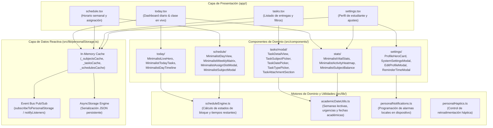

# Arquitectura del Sistema — Zora 2.0 (Mobile Native)

**Documento de Arquitectura de Software y Especificación Técnica**  
**Versión:** 2.0.0 Producción  
**Fecha:** Septiembre de 2026  
**Stack Principal:** React Native 0.86.3 | Expo SDK 57 | Expo Router 57 | TypeScript 6.0 | React 19.2.3  
**Arquitectura:** 100% Local-First / Privacidad Total / Cero Dependencia de Red  

---

## 1. Visión General y Principios de Arquitectura

Zora es un asistente académico y organizador personal para estudiantes universitarios, implementado de forma nativa sobre React Native y Expo. La arquitectura responde a un requerimiento de diseño fundamental: **autonomía operativa total y soberanía de datos**, permitiendo al usuario registrar materias, planificar horarios, gestionar entregas y consultar su credencial digital sin requerir conectividad de red ni depender de servidores centrales.

### 1.1. Principios de Ingeniería

1. **Local-First Architecture:**
   Todas las operaciones de lectura y mutación se ejecutan localmente en el dispositivo. La persistencia se delega en `@react-native-async-storage/async-storage`, evitando latencias de red, puntos únicos de fallo y requerimientos de conectividad en campus universitarios.
2. **Capa Dual de Almacenamiento (In-Memory Cache + Persistencia No Bloqueante):**
   Para eliminar el retardo inherente a lecturas I/O repetitivas en AsyncStorage, el repositorio mantiene estructuras en memoria sincronizadas con un bus de eventos reactivo (patrón Pub/Sub). Las vistas leen síncronamente desde memoria y persisten de manera no bloqueante.
3. **Optimización del Hilo de Renderizado (UI Thread Offloading):**
   Las animaciones e interacciones táctiles delegan su cálculo al motor nativo mediante `useNativeDriver: true` y funciones de aceleración Bézier (`APPLE_EASING`), asegurando una respuesta visual inmediata sin saturar el hilo de ejecución de JavaScript.
4. **Desacoplamiento Modular y Responsabilidad Única:**
   Las pantallas principales actúan únicamente como orquestadores de vista y estado, delegando la presentación a componentes atómicos y la lógica de dominio a motores matemáticos desacoplados.

---

## 2. Mapa de Arquitectura del Sistema



---

## 3. Estructura de Directorios

La estructura del código fuente refleja la separación entre navegación, presentación, constantes, contexto y lógica de dominio:

```text
Zora/
├── app/                              # Sistema de rutas basado en archivos (Expo Router)
│   ├── _layout.tsx                   # Layout raíz (SafeAreaProvider, tema global)
│   ├── index.tsx                     # Punto de entrada y redirección a (tabs)/today
│   └── (tabs)/                       # Pestañas principales
│       ├── _layout.tsx               # Barra de navegación flotante con BlurView
│       ├── today.tsx                 # Dashboard del día y estado de clase en tiempo real
│       ├── schedule.tsx              # Grilla diaria y matriz semanal de horarios
│       ├── tasks.tsx                 # Gestión de tareas con filtros de estado y materia
│       └── settings.tsx              # Perfil, credencial digital y configuración del sistema
├── src/
│   ├── components/                   # Componentes de presentación desacoplados
│   │   ├── common/                   # Modales reutilizables (ImageViewer, PdfViewer)
│   │   ├── effects/                  # Efectos visuales nativos (Confetti canvas)
│   │   ├── navigation/               # Barra de navegación flotante personalizada
│   │   ├── profile/                  # Visualizador de credencial estudiantil
│   │   ├── schedule/                 # Subcomponentes de horario (DayView, Matrix, Modales)
│   │   ├── settings/                 # Subcomponentes de perfil y ajustes del sistema
│   │   ├── stats/                    # Componentes estadísticos (VitalStats, Heatmap, Balance)
│   │   ├── tasks/                    # Subcomponentes de tareas y formulario modular
│   │   │   └── modal/                # Sub-vistas atómicas del modal de tareas
│   │   └── today/                    # Subcomponentes de vista diaria y ticker de clase
│   ├── constants/                    # Constantes centralizadas del sistema
│   │   ├── animations.ts             # Curva Bézier estandarizada (APPLE_EASING)
│   │   ├── dates.ts                  # Nombres cortos y configuración de días lectivos
│   │   └── theme.ts                  # Utilidades de borde y contraste cromático
│   ├── context/                      # Contexto de React
│   │   └── PersonalAuthContext.tsx   # Estado de identidad y credencial del estudiante
│   ├── lib/                          # Motores de cálculo puro y servicios locales
│   │   ├── academicDateUtils.ts      # Utilidades de fechas lectivas y estadísticas
│   │   ├── heatmapUtils.ts           # Algoritmo de mapeo de cuadrícula de actividad anual
│   │   ├── personalHaptics.ts        # Envoltorio de retroalimentación táctil nativa
│   │   ├── personalNotifications.ts  # Planificación de notificaciones en el sistema operativo
│   │   ├── personalStorage.ts        # Repositorio dual (Caché RAM + AsyncStorage)
│   │   └── scheduleEngine.ts         # Motor matemático de bloques horarios C1-C4
│   └── types/                        # Tipado estricto en TypeScript
│       └── personal.ts               # Modelos de dominio (Subject, Schedule, Task, etc.)
├── __tests__/                        # Pruebas automatizadas (Jest + Testing Library)
│   ├── components/                   # Pruebas unitarias y de integración de componentes
│   ├── screens/                      # Pruebas de ciclo de vida de pantallas completas
│   └── *.test.ts                     # Pruebas de motores de cálculo y repositorio
├── jest.config.js                    # Configuración de Jest con preset jest-expo
├── jest.setup.js                     # Mocks de APIs nativas de Expo y React Native
├── package.json                      # Manifiesto de dependencias y scripts de ejecución
├── tsconfig.json                     # Configuración de compilación de TypeScript
└── PRD.md                            # Documento de Requisitos de Producto
```

---

## 4. Capa de Almacenamiento: Dual In-Memory + Persistent Store

El acceso constante a almacenamiento persistente en dispositivos móviles puede generar bloqueos o caídas de fluidez si se realiza de forma asíncrona no coordinada. Zora implementa un patrón **In-Memory Cache + Persistent Store**:

```typescript
// Variables en memoria para acceso síncrono inmediato:
let _subjectsCache: Subject[] | null = null
let _schedulesCache: Schedule[] | null = null
let _tasksCache: Task[] | null = null
let _preferencesCache: AppPreferences | null = null

// Lectura síncrona sin latencia I/O:
getCachedTasks(): Task[] {
  return _tasksCache !== null ? [..._tasksCache] : []
}

// Mutación atómica: actualiza memoria, emite evento y persiste en disco:
async setTasks(tasks: Task[]): Promise<void> {
  const safeList = Array.isArray(tasks) ? tasks : []
  _tasksCache = [...safeList]
  notifyListeners() // Notificación reactiva a componentes suscritos
  try {
    const storageList = safeList.map(({ subject, ...rest }) => rest)
    await AsyncStorage.setItem(KEYS.TASKS, JSON.stringify(storageList))
  } catch (err) {
    console.error('[personalStorage] Error guardando tareas:', err)
  }
}
```

### 4.1. Ventajas Técnicas
- **Navegación Instantánea:** El cambio entre pestañas (*Hoy*, *Horario*, *Tareas*) accede de inmediato a los datos en memoria mediante los métodos `getCached*`, eliminando pantallas de carga o estados intermedios.
- **Sincronización Reactiva:** Cualquier mutación (como completar una tarea o crear una materia) notifica mediante `subscribeToPersonalStorage` a las pantallas activas, las cuales actualizan su renderizado de forma coordinada.
- **Normalización de Persistencia:** Antes de almacenar en disco, las referencias circulares o anidadas (por ejemplo, el objeto `subject` dentro de `Task`) se normalizan para optimizar el tamaño en almacenamiento y la velocidad de serialización.

---

## 5. Motores de Lógica de Negocio

### 5.1. Motor de Horarios (`scheduleEngine.ts`)
Determina el estado académico actual mediante la evaluación de la hora local del dispositivo respecto a la jornada académica oficial:
- **Bloques continuos de 90 minutos:**
  - **Bloque C1:** 07:00 – 08:30
  - **Bloque C2:** 08:30 – 10:00
  - **Bloque C3:** 10:00 – 11:30
  - **Bloque C4:** 11:30 – 13:00
- **Estados calculados:**
  - `active`: Clase actualmente en desarrollo. Calcula minutos transcurridos, tiempo restante y porcentaje de avance del bloque.
  - `before_school`: Periodo previo al inicio de la jornada (antes de las 07:00 AM).
  - `after_school`: Fin de la jornada lectiva (después de las 13:00 PM).
  - `weekend`: Fin de semana (sábados y domingos).
  - `free`: Intervalo horario sin materia asignada.

### 5.2. Motor de Fechas y Semanas Académicas (`academicDateUtils.ts`)
- Determina la semana lectiva en curso relativa a los periodos configurados para el ciclo semestral (Otoño y Primavera).
- Clasifica la urgencia de entrega de las tareas (`overdue`, `today`, `tomorrow`, `this_week`, `future`) para colorear los indicadores y priorizar la atención del estudiante.

### 5.3. Subsistema de Notificaciones Locales (`personalNotifications.ts`)
- Utiliza la API nativa de `expo-notifications` de manera puramente local (sin requerir APNs ni FCM en la nube).
- Gestiona dos tipos de alarmas:
  1. Recordatorio nocturno general de tareas pendientes (a la hora configurada por el usuario).
  2. Alertas de inicio de clase con 10 minutos de antelación para los bloques programados en el horario del día.

---

## 6. Estrategia de Pruebas Automatizadas

La calidad del código se valida mediante una batería de pruebas automatizadas sobre **Jest 29** y `@testing-library/react-native`:
1. **Pruebas de Repositorio Local (`personalStorage.test.ts`):** Verifican la consistencia de operaciones CRUD, el aislamiento de caché en memoria y la recuperación de errores ante datos corruptos.
2. **Pruebas de Fechas y Estadísticas (`academicDateUtils.test.ts`):** Validan el cálculo de semanas académicas, la asignación de urgencias y las tasas de completitud de tareas.
3. **Pruebas de Componentes y Modales:** Verifican el renderizado de filas de tareas con acciones swipe (`MinimalistTaskRow.test.tsx`), la visualización de credenciales (`MinimalistCredentialModal.test.tsx`) y el formulario de tareas (`MinimalistTaskModal.test.tsx`).
4. **Pruebas de Pantallas (`Screens.test.tsx`):** Comprueban el montaje y desmontaje seguro de todas las pantallas del sistema de pestañas.

Comandos de validación:
```powershell
# Ejecución de suites de prueba:
npm test

# Verificación de tipos estricta:
npx tsc --noEmit
```

---

## 7. Criterios de Calidad y Mantenimiento

- **Ausencia de Código Muerto:** No existen librerías no utilizadas, módulos huérfanos ni reliquias de plataformas web previas.
- **Tipado Estricto de TypeScript:** Todas las interfaces y tipos representan fielmente el dominio de la aplicación con compilación sin errores.
- **Adaptabilidad Multiplataforma:** La interfaz responde a los cortes de pantalla (*safe areas*) tanto en iOS (dispositivos con Dynamic Island y barra de inicio) como en Android.
