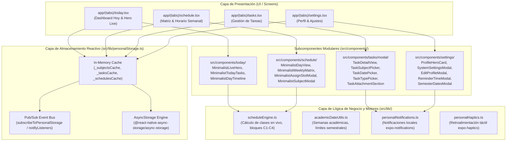

# Arquitectura del Sistema — Synapse 2.0 (Mobile Native)

**Documento de Arquitectura de Software y Especificación Técnica**  
**Versión:** 2.0.0 Producción  
**Fecha:** Septiembre de 2026  
**Stack Principal:** React Native 0.86.3 | Expo SDK 57 | Expo Router 57 | TypeScript 6.0 | React 19.2.3  
**Filosofía:** 100% Local-First / Privacidad Total / Cero Dependencia de Servicios en la Nube  

---

## 1. Visión General y Principios de Arquitectura

Synapse es un asistente académico y gestor de vida universitaria móvil nativo de alto rendimiento. Fue concebido bajo una premisa fundamental: **los datos del estudiante le pertenecen únicamente al estudiante y deben estar disponibles instantáneamente, sin importar la calidad o ausencia de conexión a internet en el campus.**

### 1.1. Principios Rectores

1. **Local-First por Diseño (Cero Nube Obligatoria):**
   No existen APIs remotas, bases de datos en la nube ni tokens de autenticación de red para la operativa diaria. Todas las operaciones CRUD se ejecutan sobre el almacenamiento local del dispositivo.
2. **Cero Latencia Perceptible (In-Memory Cache + Pub/Sub):**
   Las lecturas de estado para renderizar vistas son síncronas a través de una capa de caché en memoria RAM. La persistencia en disco ocurre en paralelo sin bloquear el hilo principal (JS Thread).
3. **Fluidez a 120 FPS / Rendimiento OLED:**
   Uso exclusivo de curvas de aceleración naturales (`APPLE_EASING`), cálculo de interpolaciones con `useNativeDriver: true`, layouts estilizados en paleta OLED Black (`#000000`, `#09090B`) y renderizado escalonado (*staggered animations*) para evitar caídas de cuadros.
4. **Resiliencia y Soberanía de Datos:**
   Portabilidad absoluta mediante copias de seguridad en formato estándar JSON (exportación/importación) y desvinculación limpia de registros huérfanos.

---

## 2. Mapa de Arquitectura del Sistema



---

## 3. Estructura de Directorios

El proyecto sigue una organización modular estricta por responsabilidad única:

```text
Synapse/
├── app/                              # Rutas de Expo Router (File-based navigation)
│   ├── _layout.tsx                   # Layout raíz (SafeAreaProvider, Tabs Shell)
│   ├── index.tsx                     # Redirección inicial hacia (tabs)/today
│   └── (tabs)/                       # Pestañas de la barra de navegación
│       ├── _layout.tsx               # Configuración del Dock inferior flotante con blur
│       ├── today.tsx                 # Pestaña "Hoy": Saludo, Hero en vivo, timeline
│       ├── schedule.tsx              # Pestaña "Horario": Vista diaria y matriz semanal
│       ├── tasks.tsx                 # Pestaña "Tareas": Lista con filtros, swipe y búsqueda
│       └── settings.tsx              # Pestaña "Perfil": Hero card, estadísticas y ajustes
├── src/
│   ├── components/                   # Componentes visuales desacoplados
│   │   ├── common/                   # Modales genéricos (ImageViewer, PdfViewer)
│   │   ├── effects/                  # Efectos visuales nativos (Confetti canvas)
│   │   ├── profile/                  # Componentes de credencial y estadísticas
│   │   ├── schedule/                 # Subcomponentes de horario (DayView, Matrix)
│   │   ├── settings/                 # Subcomponentes de perfil y ajustes
│   │   ├── tasks/                    # Subcomponentes de tareas y modal modular
│   │   │   └── modal/                # Sub-vistas atómicas del formulario y detalle
│   │   └── today/                    # Subcomponentes del dashboard diario
│   ├── constants/                    # Constantes centralizadas del sistema
│   │   ├── animations.ts             # Curvas de bezier Apple Easing
│   │   ├── dates.ts                  # Nombres cortos y configuración de días
│   │   └── theme.ts                  # Paleta OLED, bordes y estilos de contraste
│   ├── context/                      # Contextos de React
│   │   └── PersonalAuthContext.tsx   # Proveedor de identidad local del estudiante
│   ├── lib/                          # Motores puros de lógica de negocio y utilidades
│   │   ├── academicDateUtils.ts      # Cálculo de semanas académicas y semestres
│   │   ├── personalHaptics.ts        # Control unificado de respuestas hápticas
│   │   ├── personalNotifications.ts  # Programación de alertas nativas locales
│   │   ├── personalStorage.ts        # Repositorio dual (Caché RAM + AsyncStorage)
│   │   └── scheduleEngine.ts         # Motor matemático de estados de clase
│   └── types/                        # Definiciones de TypeScript
│       └── personal.ts               # Interfaces de Subject, Schedule, Task, etc.
├── __tests__/                        # Pruebas automatizadas (Jest + Testing Library)
│   ├── components/                   # Pruebas de integración de componentes y modales
│   ├── screens/                      # Pruebas de renderizado de pantallas completas
│   └── *.test.ts                     # Pruebas unitarias de almacenamiento y utilidades
├── jest.config.js                    # Configuración de pruebas con jest-expo
├── jest.setup.js                     # Mocks nativos de Expo y React Native
├── package.json                      # Manifiesto de dependencias y scripts
├── tsconfig.json                     # Configuración estricta de compilador TypeScript
└── PRD.md                            # Documento de Requisitos de Producto
```

---

## 4. Capa de Almacenamiento: Dual In-Memory + Persistent Store

Uno de los principales cuellos de botella en aplicaciones React Native es la lectura asíncrona repetitiva de `AsyncStorage` en cada montaje de pantalla. En Synapse, esto se resuelve con el patrón **In-Memory Cache + Persistent Store**:

```typescript
// Patrón de acceso ultra-rápido en personalStorage.ts:
let _subjectsCache: Subject[] | null = null
let _schedulesCache: Schedule[] | null = null
let _tasksCache: Task[] | null = null
let _preferencesCache: AppPreferences | null = null

// Lectura síncrona instantánea desde memoria:
getCachedTasks(): Task[] {
  return _tasksCache !== null ? [..._tasksCache] : []
}

// Escritura atómica que actualiza la RAM y persiste en disco de forma no bloqueante:
async setTasks(tasks: Task[]): Promise<void> {
  const safeList = Array.isArray(tasks) ? tasks : []
  _tasksCache = [...safeList]
  notifyListeners() // Notifica a todas las pantallas activas
  try {
    const storageList = safeList.map(({ subject, ...rest }) => rest)
    await AsyncStorage.setItem(KEYS.TASKS, JSON.stringify(storageList))
  } catch (err) {
    console.error('[personalStorage] Error guardando tareas:', err)
  }
}
```

### 4.1. Ventajas Clave
- **Sin pantallas de carga en navegación entre pestañas:** Al cambiar entre *Hoy*, *Horario* y *Tareas*, la lectura es síncrona desde RAM en 0 ms.
- **Reactividad desacoplada (Pub/Sub):** Al crear una materia o completar una tarea, todas las pantallas suscritas actualizan su vista automáticamente sin necesidad de recargar manualmente.
- **Normalización en disco:** Los objetos anidados redundantes (como la relación `subject` dentro de `Task`) se omiten antes de serializar a JSON para ahorrar espacio en disco y tiempo de I/O.

---

## 5. Motores de Negocio

### 5.1. Motor de Horarios (`scheduleEngine.ts`)
Calcula en tiempo real la situación académica del estudiante comparando la hora actual del dispositivo con la grilla de bloques:
- **Bloques oficiales:**
  - C1: 07:00 – 08:30
  - C2: 08:30 – 10:00
  - C3: 10:00 – 11:30
  - C4: 11:30 – 13:00
- **Estados calculados:**
  - `active`: Clase en curso (calcula porcentaje de avance del bloque y minutos restantes).
  - `before_school`: Antes de las 07:00 AM (informa minutos restantes para el inicio de la primera clase).
  - `after_school`: Después de la 01:00 PM (informa el fin de la jornada).
  - `weekend`: Sábados y domingos (estado de descanso).
  - `free`: Hora libre o autoestudio sin clase asignada.

### 5.2. Motor de Fechas Académicas (`academicDateUtils.ts`)
- Calcula de manera dinámica la semana académica activa (1 a 18+) basándose en las fechas de inicio y fin configuradas para los semestres de Otoño y Primavera.
- Ajusta automáticamente el progreso semestral en la tarjeta de estadísticas del estudiante.

### 5.3. Subsistema de Notificaciones Locales (`personalNotifications.ts`)
- Ejecutado 100% en el dispositivo con `expo-notifications`.
- Notificaciones configurables de recordatorio nocturno de entregas y aviso previo de 10 minutos antes del inicio de cada clase según el horario asignado.

---

## 6. Estrategia de Pruebas Automatizadas

La aplicación cuenta con una suite integral de pruebas automatizadas sobre **Jest 29** y `@testing-library/react-native`, cubriendo:
1. **Pruebas Unitarias de Almacenamiento:** Integridad de métodos CRUD, aislamiento de caché en memoria y resiliencia ante errores de JSON.
2. **Pruebas de Utilidades de Fechas:** Cálculo de semanas académicas, límites y desbordamientos de semestres.
3. **Pruebas de Componentes:** Renderizado de filas de tareas (`MinimalistTaskRow`), modales de credencial digital (`MinimalistCredentialModal`) y modales de creación/edición de tareas (`MinimalistTaskModal`).
4. **Pruebas de Pantallas Completas:** Montaje de todas las pantallas de navegación (`TodayScreen`, `ScheduleScreen`, `TasksScreen`, `SettingsScreen`).

Todas las suites se ejecutan mediante:
```powershell
npm test
```
Validación de tipos de TypeScript:
```powershell
npx tsc --noEmit
```

---

## 7. Criterios de Producción y Mantenimiento

- **Cero código muerto:** No existen dependencias obsoletas de web/PWA/Next.js ni funciones huérfanas en componentes.
- **Tipado estricto al 100%:** No se admiten tipos implícitos ni discrepancias de props entre componentes padres y modales hijos.
- **Independencia de plataforma:** Compatible con iOS (iPhone con soporte de Dynamic Island / Home Indicator) y Android (con manejo de Safe Area Insets).
