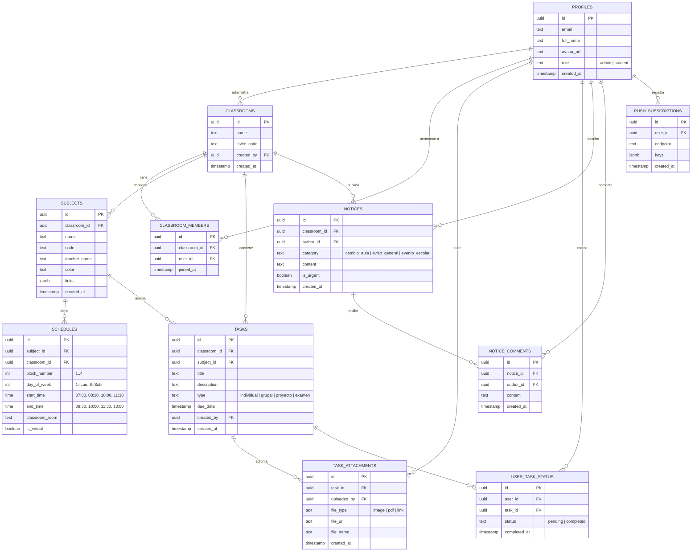

# PRD — Synapse: Control y Gestión Colaborativa de Clases (Mobile-First)

**Documento de Requisitos de Producto (Product Requirements Document)**  
**Versión:** 1.0 Final (Master Spec)  
**Fecha:** 27 de Agosto de 2026  
**Estado:** Aprobado y Consolidado para Desarrollo  
**Plataforma:** Web App Mobile-First / Progressive Web App (PWA)  
**Audiencia Objetivo:** Salón de Clases Universitario / Escolar (Alumnos y Delegados)  

---

## 1. Resumen Ejecutivo y Visión del Producto

### 1.1. Declaración del Problema
Actualmente, toda la dinámica y coordinación académica del salón de clases se realiza a través de un grupo de WhatsApp compartido. Esta dinámica genera tres problemas críticos en el día a día escolar:
1. **Pérdida de fotos de pizarra y apuntes:** Las fotos tomadas en clase quedan sepultadas rápidamente entre cientos de mensajes, stickers y conversaciones ajenas.
2. **Olvido frecuente de fechas de entrega:** Los estudiantes pierden el rastro de cuándo vencen las tareas individuales, entregas grupales y proyectos de fin de curso.
3. **Desorden de avisos importantes:** Los mensajes urgentes de los delegados (cambios imprevistos de aula, eventos institucionales, avisos de profesores) se ignoran o se pierden en el chat grupal.

### 1.2. Propuesta de Valor y Visión
**Synapse** es un centro de mando colaborativo, limpio y mobile-first diseñado a la medida de la jornada del salón. Reemplaza el caos de WhatsApp por una Progressive Web App (PWA) instalable en el celular que ofrece:
- Detección automática en tiempo real de la clase en curso en los 4 bloques diarios del horario.
- Seguimiento personalizado de tareas (individuales, grupales, proyectos y exámenes) con estado privado por estudiante.
- Galería organizada de fotos de pizarras en alta resolución con visor táctil de zoom y descarga inmediata.
- Canal oficial de avisos de delegados con hilos de respuestas directas.
- Funcionamiento garantizado 100% sin conexión a internet (Offline First) dentro del campus escolar.

---

## 2. Contexto Operativo y Dinámica Escolar Real

### 2.1. Estructura de Horario Oficial (4 Bloques de 90 minutos)
La jornada escolar consta exactamente de **4 bloques de 1.5 horas (90 minutos)** continuos de lunes a viernes/sábado:
- ⏰ **Bloque #1:** `07:00 AM – 08:30 AM`
- ⏰ **Bloque #2:** `08:30 AM – 10:00 AM`
- ⏰ **Bloque #3:** `10:00 AM – 11:30 AM`
- ⏰ **Bloque #4:** `11:30 AM – 01:00 PM`

### 2.2. Modalidad de Clases Virtuales / Asíncronas ("Horas Libres")
Dos días a la semana, uno de los bloques corresponde a una materia virtual que el salón toma como hora libre/asíncrona. La plataforma soporta la etiqueta `Virtual / Asíncrona` para diferenciar visualmente este bloque sin generar alarmas innecesarias de asistencia presencial.

### 2.3. Clasificación Exacta de Entregas y Evaluaciones
1. 👤 **Tarea Individual:** Entregable personal con fecha y hora límite.
2. 👥 **Tarea Grupal:** Trabajo en equipo con especificación de integrantes, pautas grupales y archivos adjuntos.
3. 🚀 **Proyecto:** Trabajo de ciclo con entregables continuos o hitos.
4. 📝 **Examen:** Evaluación oficial (parcial, final o examen de unidad) con temario y recursos de estudio.

---

## 3. Personas y Matriz de Permisos

| Funcionalidad / Acción | Delegado / Administrador | Estudiante / Compañero |
| :--- | :---: | :---: |
| Autenticación con Google / Email | ✅ | ✅ |
| Unirse al salón con PIN de 6 caracteres | ✅ | ✅ |
| Visualizar horario diario (Hoy) y semanal | ✅ | ✅ |
| Crear, editar y eliminar materias | ✅ | ❌ (Solo lectura) |
| Asignar bloques de horario y aulas | ✅ | ❌ (Solo lectura) |
| Publicar tareas, proyectos y exámenes oficiales | ✅ | ❌ (Solo lectura) |
| Marcar tareas como completadas (personal) | ✅ | ✅ (Privado para cada alumno) |
| Subir fotos de pizarra, apuntes, PDFs y links | ✅ | ✅ (Colaborativo y abierto) |
| Eliminar adjuntos propios subidos | ✅ | ✅ |
| Publicar avisos en el feed del salón | ✅ | ✅ |
| Comentar en los hilos de avisos de delegados | ✅ | ✅ |
| Activar Notificaciones Web Push en el teléfono | ✅ | ✅ |
| Consultar horario y tareas sin internet (Offline) | ✅ | ✅ |
| Modificar nombre y regenerar PIN del salón | ✅ | ❌ |

---

## 4. Sistema de Diseño Visual y UI/UX

### 4.1. Filosofía Estética: *Notion / Linear Dark Minimalist*
- **Paleta de Colores:** 
  - Fondos en grises oscuros / zinc (`#09090b`, `#18181b`, `#27272a`).
  - Bordes tenues de 1px (`border-zinc-800`).
  - Sombras tipo papel y acentos monocromáticos con alto contraste.
- **Tipografía:** Tipografía geométrica sans-serif ultra nítida (`Inter`, `Geist`, `-apple-system`) con tracking compacto.
- **Identificación de Materias:** Dots (puntos de color) discretos asignados a cada materia (`#3B82F6`, `#10B981`, `#8B5CF6`, `#F59E0B`, `#EC4899`, etc.).
- **Fechas Neutras y Limpias:** Fechas formateadas de forma calmada (ej: `Jueves 28 ago • 11:59 PM` o `En 2 días`), sin badges estridentes ni falsas alarmas de urgencia.

### 4.2. Componentes Clave de Navegación e Interacción
- **Floating Island Bar (Barra Inferior Flotante):**
  - Barra flotante con esquinas redondeadas (`rounded-2xl`), fondo translúcido con desenfoque (`backdrop-blur-md`), borde sutil de 1px, punto indicador bajo la pestaña activa y badge numérico en la pestaña de Tareas.
- **Bottom Sheets Táctiles Deslizables:**
  - Los formularios de creación (`+ Crear Tarea`, `+ Añadir Materia`, `+ Compartir Aviso`) y los detalles de tareas se despliegan desde la parte inferior con un tirador (drag handle), ocupando el 85% de la pantalla, con cierre por deslizamiento hacia abajo.
- **Microinteracciones y Gestos Táctiles:**
  - *Swipe to Complete:* Deslizar suavemente una tarea hacia la derecha para marcarla como completada.
  - *Pull to Refresh:* Deslizar hacia abajo en el tope de la pantalla para sincronizar datos en tiempo real.
  - *Checkbox Háptico:* Checkbox circular con micro-animación de llenado suave.
- **Visores Integrados:**
  - *Lightbox Táctil a Pantalla Completa:* Para fotos de pizarra, con soporte de zoom táctil (pinch-to-zoom), desplazamiento y botón de descarga directa.
  - *Previsualizador de PDF:* Visor embebido para leer guías y documentos con botón de descarga rápida.

---

## 5. Arquitectura de Información y Pantallas

```
┌───────────────────────────────────────────────────────────┐
│                       SYNAPSE PWA                         │
├───────────────────────────────────────────────────────────┤
│                                                           │
│  [ Pantalla Activa: Hoy | Horario | Tareas | Salón ]      │
│                                                           │
├───────────────────────────────────────────────────────────┤
│  [ 🏠 Hoy ]   [ 📅 Horario ]   [ ✅ Tareas ]   [ ⚙️ Salón ]  │
└───────────────────────────────────────────────────────────┘
```

### 5.1. Flujo de Entrada y Onboarding (2 Pasos)
1. **Paso 1 (Bienvenida & Auth):** Pantalla minimalista con el isotipo de Synapse y botón de un toque `Continuar con Google` (o Magic Link de Email).
2. **Paso 2 (Código del Salón):**
   - Campo para ingresar el **PIN del Salón (6 dígitos)** (ej. `SYN-402`).
   - Para delegados/creadores: Enlace secundario `+ Crear Nuevo Salón`.
3. Al ingresar el PIN, el estudiante accede inmediatamente a la pestaña **Hoy**.

---

### 5.2. Pestaña 1: 🏠 Hoy (Dashboard en Tiempo Real)
- **Header:** Saludo cordial, fecha actual en formato extendido y botón contextual `+ Compartir Aviso`.
- **Hero Card Adaptativo (4 Estados en Vivo):**
  1. *Estado 1: En Clase:* Badge vibrante `● EN CURSO`, nombre de la materia, aula física o enlace virtual, profesor, barra de progreso sutil y tiempo restante (`Termina en 25 min`).
  2. *Estado 2: Receso / Próxima Clase:* Badge `PRÓXIMA CLASE`, hora de inicio del siguiente bloque de 90 min y cuenta regresiva (`Comienza en 15 min`).
  3. *Estado 3: Clase Virtual / Libre:* Badge `MODALIDAD VIRTUAL / ASÍNCRONA` con recordatorio de enlaces o actividades libres.
  4. *Estado 4: Fin de Jornada / Fin de Semana:* Mensaje de jornada concluida con resumen de entregas para la siguiente jornada escolar.
- **Carrusel de Tareas Próximas:** Tarjetas horizontales de entregas para hoy y mañana con badge de tipo (`Individual` / `Grupal`) y checkbox rápido.
- **Timeline de los 4 Bloques del Día:** Lista vertical limpia con los 4 bloques cronológicos de 7:00 a 13:00 con su aula y docente.
- **Feed Oficial de Avisos de Delegados (Timeline):**
  - Tarjetas clasificadas por categoría:
    - 🚪 `Cambio de Aula` (destacado si aplica para la clase de hoy).
    - 📢 `Aviso General` (noticias de profesores, pautas de examen).
    - 🎓 `Evento Escolar` (ferias, charlas, suspensiones).
  - Cada aviso incluye autor, hora, contenido e hilo expandible de comentarios/respuestas.

---

### 5.3. Pestaña 2: 📅 Horario (Gestión Semanal y Materias)
- **Header:** Selector de días horizontal deslizable (Lunes a Sábado) + botón `Vista Grilla Completa`.
- **Botón Contextual (Delegado):** `+ Añadir Materia / Horario`.
- **Vista Diaria Detallada:**
  - Tarjetas de los 4 bloques del día seleccionado con aula, profesor y accesos directos:
    - 💬 **Grupo de WhatsApp** de la materia.
    - 📁 **Carpeta de Google Drive**.
    - 🎓 **Google Classroom / Canvas**.
    - 📹 **Enlace de Videollamada (Meet / Zoom / Teams)**.
- **Vista Grilla Semanal Completa:**
  - Matriz interactiva de scroll horizontal autosuficiente y directa (Columnas = Días, Filas = Los 4 Bloques de 90 min) con bloques compactos para consulta visual rápida de horario y aula sin necesidad de abrir modales.

---

### 5.4. Pestaña 3: ✅ Tareas & Galería de Pizarras
- **Pestañas Superiores:** `Pendientes`, `Exámenes`, `Completadas`.
- **Filtros por Materia y Modalidad:** Chips con el dot de color de cada curso y selector `Todas` | `Individuales` | `Grupales` | `Proyectos`.
- **Botón Contextual:** `+ Crear Tarea / Examen`.
- **Tarjeta de Tarea:**
  - Checkbox circular a la izquierda con animación táctil (guarda el estado privado de cada alumno).
  - Título, materia con punto de color, fecha/hora límite en formato limpio (ej. `Jueves 28 ago • 11:59 PM`).
  - Indicadores de adjuntos (ej. `📷 4 fotos de pizarra` `📄 1 PDF` `🔗 1 link`).
- **Bottom Sheet de Detalle de Tarea:**
  - Descripción completa con soporte Markdown.
  - Sección colaborativa abierta para que alumnos y delegados suban:
    - 📷 **Fotos de Pizarra y Apuntes:** Subida directa desde cámara o galería.
    - 📄 **Archivos PDF:** Guías de ejercicios, temarios y soluciones.
    - 🔗 **Enlaces Web:** Recursos complementarios de estudio.
  - Visor integrado con Lightbox táctil y lector PDF.

---

### 5.5. Pestaña 4: ⚙️ Salón & Ajustes
- **Perfil de Usuario:** Nombre, correo, avatar y rol (`Estudiante` / `Delegado`).
- **Información del Salón:**
  - Nombre del grupo (ej. *Ingeniería de Software - 6to Ciclo*).
  - PIN de Invitación con botón `Copiar Enlace / PIN` para compartir por WhatsApp en 1 toque.
- **Configuración:**
  - Switch de **Notificaciones Web Push** (recordatorios antes de vencimientos y avisos de delegados).
  - Selector de **Tema Visual** (Modo Oscuro Notion / Modo Claro / Sistema).
  - Estado del **Modo Offline** (indicador de datos en caché local IndexedDB).
- **Herramientas de Delegado:**
  - Directorio de compañeros registrados.
  - Regenerar o actualizar PIN del salón.
  - Exportar horario y entregas a formato calendario `.ics`.

---

## 6. Arquitectura Técnica y Modelo de Datos (PostgreSQL en Supabase)



---

## 7. Estrategia PWA, Soporte Offline y Notificaciones Push

1. **Manifiesto Web (`manifest.json`):**
   - `display: standalone` (pantalla completa sin barra de URL del navegador).
   - `theme_color: #09090b` y `background_color: #09090b`.
   - Iconos adaptativos PWA para Android (192x192, 512x512) y `apple-touch-icon` para iPhone.
2. **Estrategia Offline-First:**
   - Sincronización automática de materias, los 4 bloques de horarios, tareas y avisos recientes en `Dexie.js` (IndexedDB).
   - Service Worker con estrategia `StaleWhileRevalidate` para que la app abra instantáneamente incluso con modo avión o mala cobertura en las aulas.
3. **Notificaciones Push Web (VAPID):**
   - Suscripción opcional desde el teléfono.
   - Envío de recordatorios automáticos 24h y 2h antes de entregas de tareas y exámenes.
   - Alerta inmediata cuando un delegado publica un `Cambio de Aula` o `Aviso Urgente`.

---

## 8. Criterios de Aceptación del MVP

1. **Acceso:** Cualquier compañero de clase puede iniciar sesión con Google y unirse en segundos con el PIN del salón.
2. **Horario en Vivo:** El Hero Card identifica correctamente en qué bloque de 90 minutos se encuentra la jornada actual y cuántos minutos le quedan a la clase.
3. **Gestión de Tareas:** El delegado puede publicar tareas individuales, grupales, proyectos y exámenes; cada estudiante puede marcar su estado completado de forma independiente y privada.
4. **Fotos de Pizarra:** Estudiantes y delegados pueden subir fotos de la pizarra tomadas con la cámara a cualquier tarea o clase; las fotos se pueden abrir en pantalla completa con zoom táctil y descargar sin perder calidad.
5. **Avisos Oficiales:** Los delegados pueden publicar avisos categorizados (Cambio de Aula, General, Eventos) y los estudiantes pueden responder en hilos directos.
6. **Modo Offline:** La app permite consultar todo el horario semanal y la lista de tareas guardadas sin conexión a internet.
7. **PWA Instalable:** Se puede agregar a la pantalla de inicio de Android e iOS comportándose como una aplicación nativa.
