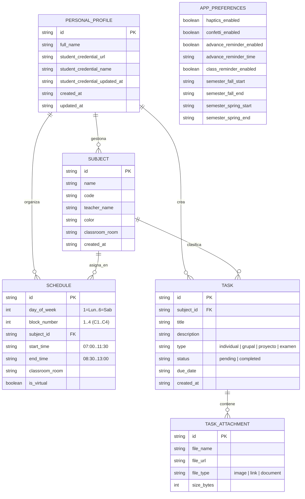

# PRD — Zora: Asistente Académico Personal Local-First (Mobile Native)

**Documento de Requisitos de Producto y Arquitectura Maestra**  
**Versión:** 2.0 Producción  
**Fecha:** Septiembre de 2026  
**Estado:** Producción Final y Consolidado  
**Plataforma:** iOS & Android (React Native 0.86.3 / Expo SDK 57 / Expo Router 57)  
**Arquitectura:** 100% Local-First / Privacidad Total (Cero dependencia de servidores en la nube)  
**Audiencia:** Estudiantes Universitarios y de Nivel Superior  

---

## 1. Resumen Ejecutivo y Visión del Producto

### 1.1. Declaración del Problema
Los estudiantes universitarios se enfrentan a una fragmentación constante de información académica:
1. **Desorden de archivos y tareas:** Las tareas, imágenes de apuntes, documentos PDF y links quedan dispersos entre chats efímeros y plataformas institucionales complejas.
2. **Dependencia de conectividad inestable:** Las plataformas en la nube o apps web fallan en campus universitarios, auditorios o zonas con baja cobertura celular.
3. **Pérdida de identidad y accesos rápidos:** Portar la credencial escolar física o buscar el PDF con el código QR en carpetas de archivos del teléfono durante el ingreso al campus resulta ineficiente.

### 1.2. Propuesta de Valor y Filosofía
**Zora 2.0** es un asistente académico personal, nativo y ultra minimalista para dispositivos móviles. Diseñado bajo la premisa de **soberanía de datos y cero latencia**:
- **100% Local-First:** Todos los datos (materias, horarios, tareas, credencial digital y preferencias) residen y persisten de forma privada en el almacenamiento local del dispositivo mediante `@react-native-async-storage/async-storage`.
- **Cero latencia:** Arquitectura de caché reactivo en memoria con listeners síncronos, garantizando transiciones a 60/120 FPS sin pantallas de carga de red.
- **Identificación escolar inmediata:** Visor integrado de credencial digital estudiantil en PDF con acceso directo a código QR.
- **Visor multimedia de alto rendimiento:** Inspección de imágenes de tareas y apuntes con gestos fluidos de *pinch-to-zoom* y doble toque, además de visor nativo de PDFs vía WebView.
- **Portabilidad total:** Sistema de exportación e importación de respaldos en formato estándar JSON.

---

## 2. Estructura Académica y Contexto Operativo

### 2.1. Bloques de Horario Oficiales (Bloques C1 a C4)
La jornada académica universitaria se divide en **4 bloques continuos de 90 minutos (1.5 horas)**:
- ⏰ **Bloque C1:** `07:00 – 08:30`
- ⏰ **Bloque C2:** `08:30 – 10:00`
- ⏰ **Bloque C3:** `10:00 – 11:30`
- ⏰ **Bloque C4:** `11:30 – 13:00`

### 2.2. Clasificación de Entregas y Evaluaciones
1. 👤 **Individual:** Tareas y lecturas personales con fecha y hora de vencimiento.
2. 👥 **Grupal:** Trabajos colaborativos con requerimientos específicos.
3. 🚀 **Proyecto:** Entregables de ciclo e investigación a largo plazo.
4. 📝 **Examen:** Evaluaciones oficiales parciales o finales con temarios y recursos de estudio adjuntos.

---

## 3. Sistema de Diseño Visual (UI/UX)

### 3.1. Filosofía Estética: *OLED Black & Precision Minimalist*
- **Paleta de Colores:** 
  - Fondo primario: Negro absoluto (`#000000`) y zinc profundo (`#09090b`, `#18181b`).
  - Bordes y separadores: Acentos sutiles de 1px (`#27272a`).
  - Tipografía: Jerarquía limpia con colores de alto contraste (`#FFFFFF`, `#D4D4D8`, `#A1A1AA`, `#71717A`).
- **Barra de Navegación Flotante (Dock):**
  - Barra inferior flotante con desenfoque de vidrio (`expo-blur`), bordes tenues, indicador reactivo en la pestaña activa y badge numérico dinámico de tareas pendientes.
- **Gestos y Hápticos:**
  - Integración háptica (`expo-haptics`) en pulsaciones clave, cambios de pestaña y confirmación de tareas.
  - Modales deslizables desde abajo (*Bottom Sheets*) con animación elástica e indicador superior de arrastre.

---

## 4. Módulos y Arquitectura de Pantallas

```
┌───────────────────────────────────────────────────────────┐
│                     ZORA 2.0 (EXPO)                       │
├───────────────────────────────────────────────────────────┤
│                                                           │
│  [ (tabs): Cronograma | Horario | Tareas | Ajustes ]      │
│                                                           │
├───────────────────────────────────────────────────────────┤
│  [ 🕒 Cronograma ] [ 📅 Horario ] [ ✅ Tareas ] [ ⚙️ Ajustes ] │
└───────────────────────────────────────────────────────────┘
```

### 4.1. Pestaña 1: 🕒 Cronograma (Dashboard Académico)
- **Header:** Saludo dinámico según la hora del día, nombre del estudiante editable y avatar/ícono de perfil con badge interactivo de credencial digital.
- **Hero Card en Vivo:**
  - Detección automática en tiempo real del bloque actual (C1 a C4).
  - Indicador dinámico de estado: *En Curso*, *Próxima Clase*, o *Jornada Finalizada*.
  - Desglose de materia, aula asignada, profesor y tiempo restante en minutos con barra de progreso.
- **Mapa de Calor Académico (Heatmap):**
  - Visualizador de intensidad y regularidad académica a lo largo de los días de la semana y semestres.
- **Línea de Tiempo Diaria:** Lista cronológica de las 4 sesiones del día con sus códigos de aula física.

### 4.2. Pestaña 2: 📅 Horario (Gestión Semanal y Grilla)
- **Selector de Días:** Carrusel horizontal de días (Lunes a Viernes / Sábado).
- **Asignador de Bloques:** Modal para vincular cualquier materia creada a los bloques C1-C4 de un día determinado, especificando el aula correspondiente.
- **Gestor de Materias:**
  - Creación y edición de materias con selector de paleta cromática identificadora, nombre del curso, código y nombre del docente.
- **Grilla Semanal Completa:** Vista panorámica compacta para revisar el horario general de toda la semana de un vistazo.

### 4.3. Pestaña 3: ✅ Tareas & Visor Multimedia
- **Filtros Inteligentes:** Pestañas de estado (`Pendientes`, `Exámenes`, `Completadas`) y chips de filtrado por materia.
- **Listado y Checkbox Háptico:**
  - Marcado instantáneo de completado con retroalimentación háptica.
  - Indicadores visuales de tipo de tarea y cantidad de adjuntos.
- **Modal de Creación / Edición:**
  - Selección de materia asociada, título, descripción y fecha/hora límite mediante `DateTimePicker` nativo.
  - Selección de adjuntos multimedia:
    - 📷 Fotos de apuntes e imágenes (`expo-image-picker`).
    - 📄 Documentos PDF (`expo-document-picker`).
    - 🔗 Enlaces web y repositorios externos.
- **Visores Multimedia Integrados:**
  - *Visor de Imagen con Zoom Táctil:* Modal a pantalla completa impulsado por `react-native-gesture-handler` con gestos de pellizco (*pinch-to-zoom*) de hasta 4x, doble toque para zoom inmediato y navegación fluida con fondos transparentes.
  - *Visor de Documentos PDF:* Lector integrado vía `react-native-webview` con opción para compartir/abrir en visor externo del sistema (`expo-sharing`).

### 4.4. Pestaña 4: ⚙️ Ajustes & Credencial Digital
- **Identificación Estudiantil:**
  - Opción de subir y almacenar el archivo PDF de la credencial oficial de la institución universitaria.
  - Visualización rápida de la credencial o modal directo de acceso al código QR para escáneres de acceso físico.
  - Opción para reemplazar o eliminar la credencial digital cargada.
- **Edición de Perfil:** Modificación local de nombre completo del estudiante.
- **Preferencias del Sistema:**
  - Interruptores de respuesta háptica y animaciones.
  - Configuración de fechas de inicio y fin de ciclos lectivos (Semestre Otoño / Primavera).
- **Copia de Seguridad y Migración:**
  - `Exportar Respaldo JSON`: Generación y descarga/compartición de archivo `.json` con todo el estado del usuario.
  - `Importar Respaldo JSON`: Restauración instantánea y segura de materias, horarios, tareas y configuraciones.
  - `Limpiar Datos`: Opción protegida para restablecer la aplicación a su estado inicial de fábrica.

---

## 5. Arquitectura Técnica y Almacenamiento

### 5.1. Stack Tecnológico
- **Framework:** React Native 0.86.3 / React 19.2.3 / Expo SDK 57.
- **Enrutamiento:** Expo Router 57 (File-based navigation con pestañas desacopladas).
- **Almacenamiento Persistente:** `@react-native-async-storage/async-storage` 2.2.0 con caché síncrona en memoria.
- **Gestos y Animaciones:** `react-native-gesture-handler` ~2.32.0 y `Animated` nativo a 120 FPS.
- **Íconos:** `lucide-react-native` (^0.453.0).

### 5.2. Capa de Almacenamiento Reactiva (`personalStorage`)
Para evitar latencias y renderizados bloqueantes, el servicio `personalStorage` implementa un patrón **In-Memory Cache + Persistent Store**:
1. **Acceso síncrono:** Métodos de caché (`getCachedSubjects`, `getCachedSchedules`, `getCachedTasks`, `getCachedPreferences`) devuelven al instante los datos ya parseados.
2. **Notificación pub/sub:** Todos los componentes se suscriben a actualizaciones de almacenamiento mediante `subscribeToPersonalStorage(listener)` para sincronizar la UI en caliente sin depender de contextos pesados.
3. **Escritura asíncrona segura:** Cada mutación actualiza la memoria atómicamente y persiste el JSON en AsyncStorage en segundo plano.

### 5.3. Modelo de Datos Local (TypeScript)



---

## 6. Criterios de Calidad y Producción

1. **Cero Dependencias Obsoletas:** Ningún artefacto de navegador web, PWA o Service Workers residuales en el repositorio.
2. **Robustez de Tipos:** Compilación limpia con 0 errores bajo TypeScript (`npx tsc --noEmit`).
3. **Resiliencia sin Conexión:** Funcionamiento 100% operativo sin necesidad de acceso a red o credenciales de servicios de terceros.
4. **Experiencia de Usuario Fluida:** Respuesta háptica precisa, animaciones consistentes de 60 FPS y rendimiento óptimo en dispositivos móviles.
